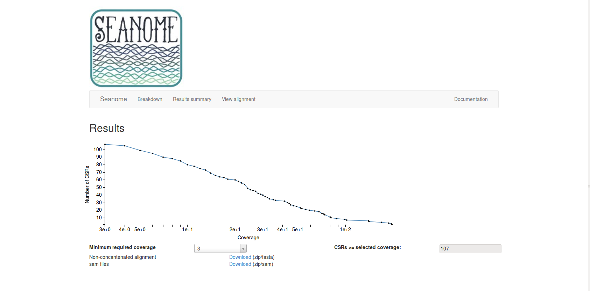

.. _tutorial:

******************
Seanome Tutorial
******************

.. _submission:

Submitting a Job
================

The Seanome website can be accessed at th following URL: http://166.122.79.71/seanome/

Seanome, requires that all files be in the fastq format (they should not be compressed).

You will be asked to solve a captcha to continue. The next page will present you with login information for an SFTP server where you can upload your job.
The page also contains information on your Job URL where your results will be hosted. Before you click on that URL though, we need to first upload your data to the server using SFTP.  

.. _entry:

If you need a SFTP client, you may want to look at `filezilla <https://filezilla-project.org/download.php?show_all=1>`_.
It is available for the most common platforms (mac, window, linux).

Once you login using the address, username and password provided,  you will see a directory hierarchy similar to that in :numref:`filezilla-img`.

.. _filezilla-img:

   
   filezilla client

Before you start uploading your data using the SFTP, we will need to navigate on the remote server to your users’ specific directory. 
Then, expand the upload directory by click the arrow, and you should see a folder with your username.  Click on that folder to expand it as in :numref:`upload-dir`.

.. _upload-dir:

   upload directory

Next, upload your files by dragging them from your desktop, or from a folder on your computer, into the remote site. This area is circled in red in :numref:`drop-area`. 

.. _drop-area:

   drop area   

Once all the files have been uploaded, we can close the SFTP client and continue forward on the website by visiting the the job URL that was provided.

The job URL will provide similar content as seen in :numref:`setup`.

.. _setup:

  
   setup

Make sure you indicate that whether your samples come from a single or from multiple species by selecting the appropriate dropdown option for the question “Are your samples from multiple or from a single species”

Also, associate a label (sample name) to each of the paired Fastq files you are working with. For example, the “Common Label” for the files A_Reads1.fastq and A_Reads2.fastq could be SAMPLE_A where as the “Common Label” for B_Reads1.fastq and B_Reads2.fastq could be SAMPLE_B.

.. _setup-done:

   setup complete

Once everything is setup, you can click 'submit job' and click 'yes', to the pop-up that appears. The jobs is now submitted and should be running on the server.  Depending on how large your dataset is, it may take between few hours to few days to complete.

You will need to keep the job URL so that you can return at a later point in time to check if your job has completed as well as collect your results.

Once the job is completed a page similar to :numref:`job-done` will be displayed.

.. _job-done:

  
   job done

.. _results:

Seanome Results
===============

On the landing page for our results, a very general overview of the job is provided.

- Total number of species you provided us with
- The length of the pseudo genome we created.  This is typically a concantentaion of all the CSRs (commonly shared regions)
- The breakd own of the number of samples per CSR, as well as how many CSRs have a given number of samples.

The break down of CSRs by number of samples, is used to help sub-divide the results.  
In our example dataset, we see that the results are sub-divided into samples with 1 sample, and those that have 2 samples.  
A visual representation is provided using circles that are sized based on the number of CSRs with a given number of samples.
To drill down into the results, you begin by clicking on the circle with the corresponding number of samples that you wish to explore.

For example, if I click on the green circle with the number 2 (corresponding to CSRs with 2 samples) I am provided with the the page seen in :numref:`results-s2`.  

.. _results-s2:

  
   Results summary page for CSRs containing two samples

This page is know as 'Results summary'.  This view provides us with a breakdown of the number of CSRs at or above a given coverage value.  Coverage corresponds to, how many individual sequences overlap
with the region a CSR corresponds to.  This page also provides us with the first possible download of our result set.  The downloads are generated based on the minimum coverage that is selected.  For instance, if I keep the minimum required coverage at 3, and tried to download the sam or fasta files, I would download a zip file that contains 107 files.  If I change the required
coverage to 59, The zip that I download will only contain 20 files (:numref:`filtered-results`).

.. _filtered-results: 

  Results summary with coverage filter, for download, is set to 59

In the menu bar, their is another page that can be visited, named 'View alignment', as see in :numref:`viewaln`.  On this page, one is able to view the resulting alignment, which primarily is of use when dealing with multiple species, as well as a display of snps associated with a given alignment.  In the case the users wishes to download the SNP information, the download link on this page provides this information in the vcf format.

.. _viewaln:

  View Alignment page
